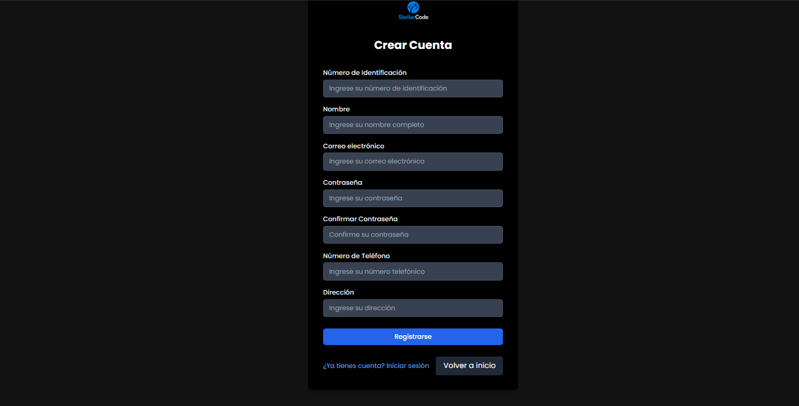

hola


# Sistema de Gestión de Parqueadero 🚗

¡Bienvenido al proyecto de **Sistema de Gestión de Parqueadero**! Este es un proyecto desarrollado en React que permite gestionar la entrada, salida y estadísticas de vehículos en un parqueadero.

---
## Características principales ✨

- **Registro de vehículos**: Permite registrar la entrada de vehículos al parqueadero.
- **Control de salida**: Registra la salida de vehículos y calcula el costo del estacionamiento.
- **Estadísticas en tiempo real**: Muestra información como la cantidad de vehículos estacionados, ingresos del día y disponibilidad de espacios.
- **Interfaz amigable**: Diseño intuitivo y fácil de usar.

---

## Tecnologías utilizadas 🛠️

- **React**: Biblioteca de JavaScript para construir la interfaz de usuario.
- **React Router**: Para manejar la navegación entre páginas.
- **Tailwind CSS**: Framework de estilos para diseñar la interfaz.
- **Axios**: Para realizar peticiones HTTP a una API (si se integra con un backend).
- **LocalStorage**: Para almacenar datos temporalmente en el navegador (en caso de no usar backend).

---

## Instalación y configuración ⚙️

Sigue estos pasos para configurar y ejecutar el proyecto en tu máquina local:

1. **Clona el repositorio**:
   ```bash
   git clone https://github.com/tu-usuario/parqueadero-react.git
   ```

2. **Instala las dependencias**:
   ```bash
   cd parqueadero-react
   npm install
   ```

3. **Ejecuta el servidor de desarrollo**:
   ```bash
   npm start
   ```

4. **Abre el proyecto en tu navegador**:
   Visita `http://localhost:3000` para ver la aplicación en funcionamiento.

---

## Estructura del proyecto 📂

```
parqueadero-react/
├── public/                  # Archivos públicos (HTML, imágenes, etc.)
├── src/                     # Código fuente del proyecto
│   ├── components/          # Componentes reutilizables
│   ├── pages/               # Páginas de la aplicación
│   ├── services/            # Lógica para manejar datos (API, LocalStorage, etc.)
│   ├── styles/              # Archivos de estilos (CSS, Tailwind, etc.)
│   ├── App.js               # Componente principal
│   └── index.js             # Punto de entrada de la aplicación
├── .gitignore               # Archivos y carpetas ignorados por Git
├── package.json             # Dependencias y scripts del proyecto
└── README.md                # Este archivo
```

---

## Capturas de pantalla 📸

 
*Pagina inicio*


*Registro Clientes*


*Inicio de sesion Clientes*


*Inicio de sesion empleados*


*Panel de control*


*Gestion de clientes*


*Gestion de administradores*


*Agente IA de apoyo*

---


## Cómo contribuir 🚀

¡Las contribuciones son bienvenidas! Si deseas mejorar este proyecto, sigue estos pasos:

1. Haz un **fork** del repositorio.
2. Crea una nueva rama (`git checkout -b feature/nueva-funcionalidad`).
3. Realiza tus cambios y haz commit (`git commit -m 'Añade nueva funcionalidad'`).
4. Sube los cambios a tu rama (`git push origin feature/nueva-funcionalidad`).
5. Abre un **Pull Request** y describe tus cambios.

---

## Licencia 📄

Este proyecto está bajo la licencia **MIT**. Para más detalles, consulta el archivo [LICENSE](LICENSE).

---

## Contacto 📧

Si tienes alguna pregunta o sugerencia, no dudes en contactarme:

- **Nombre**: [Tu nombre]
- **Email**: [breynersmartinezmunoz@gmail.com]
- **GitHub**: [@tu-usuario](https://github.com/tu-usuario)

---

¡Gracias por visitar este proyecto! Espero que te sea útil. 😊
```
